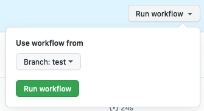

# cultuurnet/apidocs

This repository contains all the API documentation available at https://docs.publiq.be, hosted by [Stoplight.io](https://stoplight.io) who provide a beautiful interface to browse them.

## Table of contents

- [Requirements](#requirements-)
- [Getting started](#getting-started-)
- [Contribution guidelines](#contribution-guidelines-)
- [Adding a new project](#adding-a-new-project-)
- [Project structure](#project-structure-)
- [Opening your project in Stoplight Studio](#opening-your-project-in-stoplight-studio-)
- [OpenAPI files](#openapi-files-)
- [Docs](#docs-)
- [Sidebar](#sidebar-)
- [Images](#images-)
- [Links](#links-)
- [Automatic checks](#automatic-checks-)
- [Automatically fixing (some) errors](#automatically-fixing-some-errors-)
- [Useful tools and resource](#useful-tools-and-resources-)

## Requirements 🐙

To contribute to our API documentation, some basic knowledge of [git](https://git-scm.com/) is required so you can commit your changes to a temporary branch and get them reviewed before they get published.

The following tools can also be helpful but are not strictly required:

- [Stoplight Studio](https://stoplight.io/studio/), a GUI editor for API documentation built by https://stoplight.io (where our documentation is hosted). However technically any file editor is fine.
- [Node](https://nodejs.org/en/) and [Yarn](https://yarnpkg.com/getting-started/install) to run the [automatic checks](#automatic-checks-) on your own machine, and to run the [automatic fixer](#automatically-fixing-some-errors-) in case of problems. (Any recent version should be fine.) However, the automatic checks will also run in GitHub itself for every push, and you can also [run the automatic fixer online via GitHub Actions](https://github.com/cultuurnet/apidocs/actions/workflows/docs-linting-fix.yml).

## Getting started 🚀

Clone this repository to your local machine.
```
git clone git@github.com:cultuurnet/apidocs.git
```

## Contribution guidelines ✨

Anyone can contribute to our API documentation. To make the process as smooth as possible, please take the following guidelines into consideration:

*   Make your changes on a branch separate from `main` first. (Pushes to `main` will automatically be rejected!) Use a branch name that is prefixed with your project's name. For example `uitdatabank/your-branch-name` or `widgets/your-branch-name`.
*   Do not edit multiple projects in the same branch unless the changes are related to each other.
*   Avoid branches with a lot of changes that are not related, even within the same project. If you need to add a lot of documentation, aim for small incremental steps so the review process stays manageable and you get feedback early on.
*   Use [atomic commits](https://curiousprogrammer.dev/blog/why-i-create-atomic-commits-in-git/).
*   Use [good commit messages](https://cbea.ms/git-commit/). Avoid generic commit messages like `Updated example.md` or `PR remarks`.
*   Create a [draft pull request](https://docs.github.com/en/pull-requests/collaborating-with-pull-requests/proposing-changes-to-your-work-with-pull-requests/about-pull-requests#draft-pull-requests) if your changes are not ready for review yet but you want to open a pull request already.
*   Fill in the description of your pull request with the template that is automatically provided.

When your changes are ready create a pull request if you haven't done so yet, or [mark your draft pull request as ready for review](https://docs.github.com/en/pull-requests/collaborating-with-pull-requests/proposing-changes-to-your-work-with-pull-requests/changing-the-stage-of-a-pull-request#marking-a-pull-request-as-ready-for-review). One or more reviewers will automatically be assigned to go over your changes and give feedback or their approval.

After approval, it is up to the pull request author to merge the changes (if the author is part of our organization). Pull requests from external forks will be merged by the reviewers.

If a reviewer has approved but there are still open comments (from the same reviewer or another one), please be considerate and resolve those first before merging.

## Adding a new project 🐣

Adding a new project involves multiple steps both in this git repository and on https://docs.publiq.be.

Because some of these steps require special permissions, it is not possible to do this yourself. Instead, [create an issue with the "New project" template](https://github.com/cultuurnet/apidocs/issues/new?assignees=bertramakers&labels=project&template=new-project.md&title=New+project%3A+YOUR+PROJECT+NAME+HERE) and fill out all required info.

An admin will then automatically be assigned to add the new project for you.

## Project structure 🌿

Every project has its own space inside the `projects` directory with the same name as their URL slug on https://docs.publiq.be. For example:

```
projects/
├─ authentication/  # https://docs.publiq.be/docs/authentication
├─ errors/          # https://docs.publiq.be/docs/errors
├─ guidelines/      # https://docs.publiq.be/docs/guidelines
├─ uitdatabank/     # https://docs.publiq.be/docs/uitdatabank
├─ uitpas/          # https://docs.publiq.be/docs/uitpas
├─ widgets/         # https://docs.publiq.be/docs/widgets
├─ ...
```

Our documentation is hosted by [Stoplight](https://stoplight.io), which expects a specific directory structure:

```
projects/
├─ authentication/
│  ├─ assets/         # Contains all your static files
│  │  ├─ images/      # Contains all your images
│  ├─ docs/           # Contains all your .md files for guides
│  ├─ reference/      # Contains all your OpenAPI files (preferably .json)
│  ├─ toc.json        # Contains the config of your project's sidebar
├─ ...
```

It is important to adhere to this structure to avoid problems on the hosted version of our docs at https://docs.publiq.be or inside the Stoplight Studio editor.

## Opening your project in Stoplight Studio 🤖

If you are just starting out with API documentation in this repository, it is advised to work with the [Stoplight Studio](https://stoplight.io/studio/) editor because it gives you a preview of how your documentation will look when published on https://docs.publiq.be.

When opening your project in Stoplight Studio, it is important to **open a single project**! If you instead open the whole repository, or the whole `projects` folder at once, Stoplight Studio will not correctly find your OpenAPI files, docs, images, and sidebar configuration file. 
Instead, start the app and on the start screen click "Open Existing Folder". Then pick the directory of your project in your local copy of this repository.

Stoplight Studio offers 3 tabs in its sidebar to browse your files: `APIs`, `Docs`, and `Files`. While you can use whichever one you prefer, the `Files` tab give the most complete view of all the files in your project (including all the files from `APIs` and `Docs`).

## OpenAPI file(s) 🔌

**Directory: `reference`**

The complete technical overview of your API's endpoints must be documented in an [OpenAPI](https://www.openapis.org/) file (previously called "Swagger"). If you have multiple APIs inside your project, your project may have multiple OpenAPI files.

Every OpenAPI file must follow version 3.x of the OpenAPI spec, preferably [3.1.0](https://spec.openapis.org/oas/latest.html) or later when possible.

Preferably the OpenAPI files are formatted as JSON, but YAML is also allowed if necessary.

[Stoplight Studio](https://stoplight.io/studio/) offers an easy-to-use interface to edit and preview OpenAPI files, and also includes a live report of the automatic checks that we run for OpenAPI files. But you can also add or edit OpenAPI files using any other JSON/YAML editor that you prefer.

## Docs 👩‍🏫

**Directory: `docs`**

How-to guides and other pages outside of the OpenAPI files all live inside the `docs` directory of your project.

Every page is a Markdown (`.md`) file, which you can edit with a Markdown editor. However, Stoplight supports some [special syntax](https://meta.stoplight.io/docs/studio/ZG9jOjg0-stoplight-flavored-markdown-smd) that allows you to for example embed YouTube and Vimeo videos or to add info/warning/danger/success messages. 
This "Stoplight Flavored Markdown" syntax is usually not supported in every Markdown editor. 
Therefore it is advised to use [Stoplight Studio](https://stoplight.io/studio/) to edit the Markdown files, especially if you want to see a nice preview of how your pages will look on https://docs.publiq.be.

Note that Markdown files should not be used to create a complete reference of all of your API's endpoints. They should only be used for how-to guides and other extra information that cannot be documented in your OpenAPI file(s).

## Sidebar 🔎

**File: `toc.json`**

When you add or remove OpenAPI or Markdown files, your project's sidebar will not automatically be updated to add/remove links for them. Instead, you have to manage the sidebar links manually inside the `toc.json` file of your project. The exact syntax and options are described in [Stoplight's documentation](https://meta.stoplight.io/docs/platform/ZG9jOjIxOTkxNTkz-project-sidebar#project-sidebar).

## Images 👨‍🎨

**Directory: `assets/images`**

To ensure that all of your images display correctly on https://docs.publiq.be they must be stored inside the `assets/images` directory of your project. 
You may use subdirectories if you want.

When referencing images inside your Markdown files, you should always use relative URLs. 
For example, if your file is `docs/introduction.md`:
```

```

If you do not follow these guidelines images may not appear on https://docs.publiq.be even if they display in Stoplight Studio's preview.

## Links ⚓️

✅ Always use relative URLs as much as possible when linking to Markdown files or OpenAPI operations inside the same project.

⚠️ Avoid absolute URLs (for example `https://docs.publiq.be/docs/project/file.md`) when linking to docs or OpenAPI operations inside the same project. 
They will always point to a specific branch (or the default one), and you either won't be able to link to new docs or OpenAPI operations added in your new branch (because they won't exist yet on the default branch), or you will need to link to them with a URL with your branch name and that URL will break once your branch gets merged and deleted.

👉 When linking **to a Markdown file** from **another Markdown file**, use `[Your link text](./your-file.md)`.

👉 When linking **to a Markdown file** from **an OpenAPI file**, use `[Your link text](../docs/your-file.md)`.

👉 When linking **to an OpenAPI operation** from **a Markdown file**, use `[Your link text](../reference/api.json/paths/~1your~1path~1here/get)`. Slashes in the API path are encoded as `~1`. (This example will link to the `GET /your/path/here` operation inside `api.json`.)

👉 When linking **to an OpenAPI operation** from **an OpenAPI file**, use `[Your link text](./api.json/paths/~1your~1path~1here/get)`. (This example will link to the `GET /your/path/here` operation inside `api.json`.)

️👉 When linking **to Markdown files or OpenAPI operations** in **other projects**, only absolute URLs can be used.

## Automatic checks 🔁

To avoid common mistakes like dead links in how-to guides or violations of our [API design guidelines](https://docs.publiq.be/docs/guidelines) in OpenAPI files, automatic checks will run for every push to a branch.

If you create a pull request for your branch and some checks are failing, your pull request cannot be merged until the reported errors are fixed.

If you want you can run these checks yourself on your local machine to spot issues early on, and even fix some of them automatically.

First, make sure you have node and yarn installed as per the [requirements](#requirements-) mentioned above.

Second, run `yarn install` in the root of your local clone of this repository to install all required packages for the checks to work.

Then, run any of the following commands in the root of the cloned repository:

*   `yarn api:lint` to check for syntax errors or design guidelines violations inside the OpenAPI files
*   `yarn docs:lint` to check the `.md` files (guides) for mistakes or syntax errors

## Automatically fixing (some) errors ✅

Warnings or errors reported by `yarn api:lint` (a.k.a. the `CI / openapi` check on GitHub) always need to be fixed manually in the OpenAPI file(s) of your project.

Warnings or errors reported by `yarn docs:lint` (a.k.a. the `CI / docs` check on GitHub) can sometimes be fixed automatically, depending on the exact issue. For example formatting issues can be fixed automatically, but dead links not.

If you have `node` and `yarn` installed locally and ran `yarn install` to install all required packages, you can run `yarn docs:lint:fix` to try to fix the linting issues. Any issues that can be fixed will be fixed, and you can then commit them.

You can also run the same script on GitHub itself via https://github.com/cultuurnet/apidocs/actions/workflows/docs-linting-fix.yml. 

Click "Run workflow", select the branch you are working on (make sure it's up-to-date!), and hit the green "Run workflow" button. If any errors were fixed, they will be automatically committed back to your branch. Make sure to pull these changes in your local copy of the docs before making more changes to avoid merge conflicts!



## Useful tools and resources 🌐

While not required, you can use the following links to help you write excellent documentation:

*   https://hemingwayapp.com/ for writing clearly by avoiding passive voice, long sentences, and so on.
