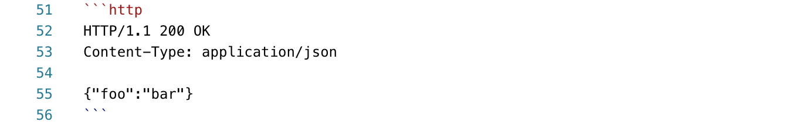
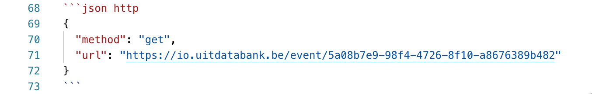

# HTTP examples

A lot of times your guides will include examples of HTTP requests and/or responses to illustrate API calls. To keep these examples in a consistent format, we have decided on a common standard which is documented here.

### ❌ curl examples

Don't document an example as a `curl` command. Instead, use the [HTTP message format](https://developer.mozilla.org/en-US/docs/Web/HTTP/Messages).

`curl` examples are great for copy-pasting to try something out quickly in a terminal, but are hard to read if you want to perform the HTTP request in another tool or programming language.

To make your example easy to try out, you can include a "try it" block using the [HTTP request maker functionality](https://meta.stoplight.io/docs/studio/docs/Documentation/03a-stoplight-flavored-markdown.md#http-request-maker) provided by Stoplight.

This will make it easy to perform the request from the page the visitor is on, or copy-paste code to perform a HTTP request in a programming language of their choice (including `curl`).

### ✅ GET example (no body)

The following codeblock in the Stoplight editor

<!-- focus: false -->


becomes 👇

```http
GET /path HTTP/1.1
Host: https://example.com
Accept: application/json
```

### ✅ POST example (with body)

The following codeblock in the Stoplight editor

<!-- focus: false -->


becomes 👇

```http
POST /path HTTP/1.1
Host: https://example.com
Content-Type: application/json

{"foo":"bar"}
```

### ✅ Response example

The following codeblock in the Stoplight editor

<!-- focus: false -->



becomes 👇

```http
HTTP/1.1 200 OK
Content-Type: application/json

{"foo":"bar"}
```

### ✅ Try it out functionality

The HTTP request maker functionality is documented [in Stoplight's own documentation](https://meta.stoplight.io/docs/studio/docs/Documentation/03a-stoplight-flavored-markdown.md#http-request-maker).

For example, to demonstrate how to retrieve an event from UiTdatabank:

<!-- focus: false -->



becomes 👇

```json http
{
  "method": "get",
  "url": "https://io.uitdatabank.be/event/5a08b7e9-98f4-4726-8f10-a8676389b482"
}
```
