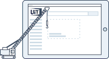

<!-- focus: false -->

## Widgets

A warm welcome to our Widgets documentation! 👋

Widgets are ready-made HTML/JS snippets that you can include in your own website to quickly provide a search page for cultural activities. They can be customized and finetuned to your own needs, for example by changing the colors and fonts, or only showing activities that are happening in your region.
